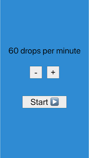
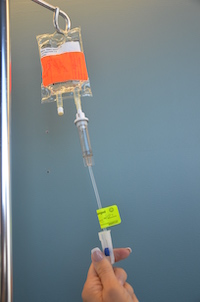
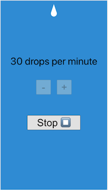

# A drip IV simulator to help setup IVs dripping frequency

## How to use

1. Set the desired rate (drops per minute)

2. Press start

3. Adjust the Roller Clamp with the beeps

4. Stop the beeps

References:

1. https://en.wikipedia.org/wiki/Intravenous_therapy
2. Roller Clamp Images from Chapter 7 of Clinical Skills book: https://opentextbc.ca/clinicalskills

Inspired by:

1. CSS => "Drip Drop Animation (No JS)" https://codepen.io/abehjat/pen/oXMENv

---

## Development:
